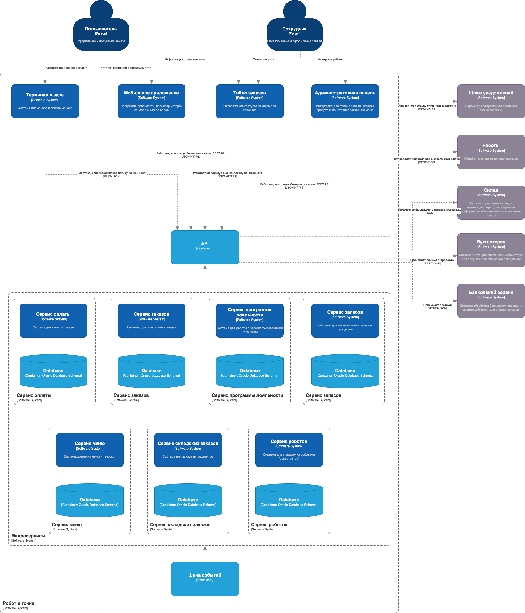

# Компонентная архитектура

### Диаграмма компонентов

На диаграмме представлены компоненты микросервисной архитектуры системы и интеграции между компонентами и внешними 
системами.

### Описание компонентов и внешних систем

| **Компонент**               | **Тип**              | **Описание**                                                        |
| :-------------------------- | :------------------- | :------------------------------------------------------------------ |
| Мобильное приложение        | Container            | Приложение для оформления и просмотра заказов                       |
| Терминал в зале             | Container            | Приложение для оформления заказов                                   |
| Табло заказов               | Container            | Приложение для просмотра статусов заказов                           |
| Административная панель     | Container            | Приложение для управления системой со стороны сотрудников ресторана |
| Сервис программы лояльности | Container            | Сервис управления данными пользователей                             |
| База данных аккаунтов       | Container            | Хранение персональных данных пользователей                          |
| Cервис меню                 | Container            | Сервис управления меню                                              |
| База данных меню            | Container            | Хранение информации о меню                                          |
| Cервис заказов              | Container            | Сервис управления заказами                                          |
| База данных заказов         | Container            | Хранение информации по заказам                                      |
| Cервис запасов              | Container            | Отслеживание запасов в ресторане                                    |
| База данных запасов         | Container            | Хранение информации по запасам                                      |
| Cервис оплат                | Container            | Сервис управления платежами                                         |
| База данных платежей        | Container            | Хранение информации по платежам                                     |
| Сервис складких запасов     | Container            | Сервис управления складом                                           |
| База данных склада          | Container            | Хранение данных склада о продуктах                                  |
| Cервис роботов              | Container            | Сервис управления роботами                                          |
| База данных роботов         | Container            | Хранение данных по роботам                                          |
| API gateway                 | Container            | Взаимодействие между внутренними и внешними сервисами               |
| Шлюз уведмолений            | External&nbsp;system | Отправка SMS/уведомлений пользователям                              |
| Роботы                      | External&nbsp;system | Приготовление блюд в ресторане                                      |
| Склад                       | External&nbsp;system | Заказ товаров для пополнения запасов                                |
| Банковский сервис           | External&nbsp;system | Обработка платежей                                                  |
| Бухгалтерия                 | External&nbsp;system | Обработка и хранение информации об операциях                        |
