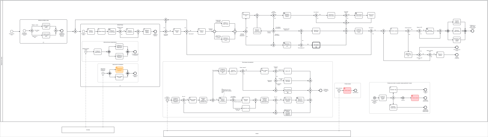
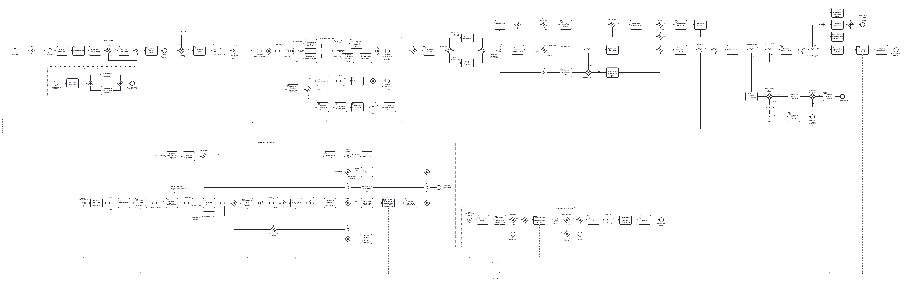

# Описание бизнес-процессов

На схеме представлены следующие бизнес-процессы:

- Оформление заказа через терминал 
- Регистрация пользователя в программе лояльности через терминал

- Оформление заказа через мобильное приложение  
- Регистрация пользователя в программе лояльности через мобильное приложение 

