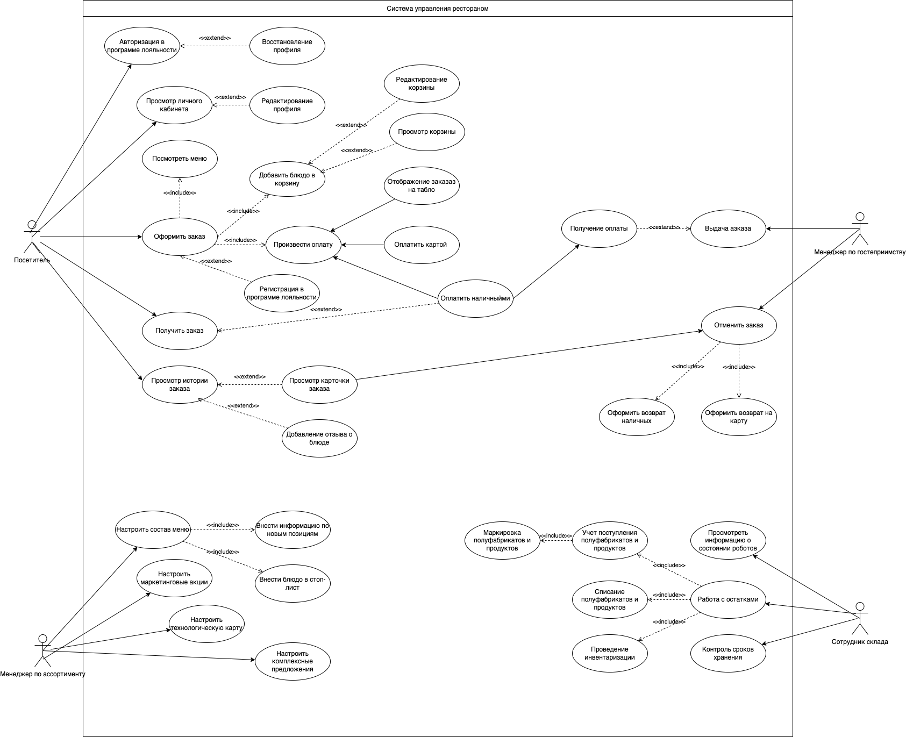

# Use сase диаграмма

Основные функции системы управления рестораном отображены на use case диаграмме:

### Use cases MVP

| **Номер** | **Название**                | Система       |
| :-------- | :-------------------------- | :------------ |
| UC-05     | Добавление блюда в корзину  | МП и терминал |
| UC-06     | Просмотр корзины            | МП и терминал |
| UC-07     | Редактирование корзины      | МП и терминал |
| UC-08     | Оформление заказа           | МП и терминал |
| UC-09     | Оплата заказа картой        | МП и терминал |
| UC-10     | Получение заказа            | МП и терминал |
| UC-11     | Оплата заказа наличными     | Терминал      |
| UC-13     | Просмотр карточки заказа    | МП и терминал |
| UC-15     | Добавление отзыва о блюде   | МП            |
| UC-16     | Отображение заказа на табло | МП и терминал |
| UC-17     | Оформление доставки         | МП            |

### Use cases первого релиза

| **Номер** | **Название**                       | Система       |
| :-------- | :--------------------------------- | :------------ |
| UC-01     | Регистрация в программе лояльности | МП и терминал |
| UC-02     | Авторизация в программе лояльности | МП и терминал |
| UC-03     | Восстановление пароля              | МП и терминал |
| UC-04     | Просмотр личного кабинета          | МП и терминал |
| UC-12     | Просмотр истории заказов           | МП            |
| UC-14     | Отмена заказа                      | МП            |

