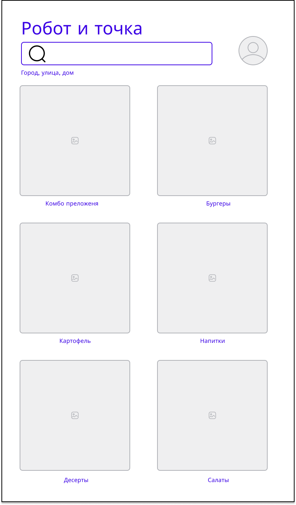
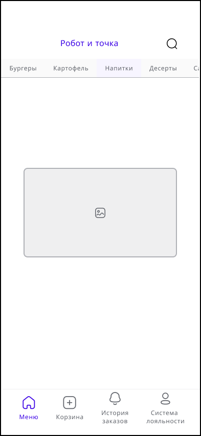

# WF-01 Главный экран. Список категорий меню

!!! quote ""
    Экран является реализацией сценария [UC-05 Добавление блюда в корзину].

## Прототип

### Терминал

#### Элементы экрана

| **Элемент**             | **Описание**                                   | Взаимодействие&nbsp;с&nbsp;API          |
| :---------------------- | :--------------------------------------------- | :-------------------------------------- |
| Название ресторана      | Название ресторана «Робот и точка».            | —                                       |
| Адрес ресторана         | Адрес где находится ресторан: горо/улица/дом   | —                                       |
| ЛК программы лояльности | Ссылка, переход в личный кабинет пользователя. | —                                       |
| Поиск                   | Строка поиска по блюдам.                       | Вне MVP                                 |
| Категории               | Список категорий.                              | Метод «Получение списка категорий меню» |

### Мобильное приложение

#### Элементы экрана

| **Элемент**             | **Описание**                                   | Взаимодействие&nbsp;с&nbsp;API          |
| :---------------------- | :--------------------------------------------- | :-------------------------------------- |
| Название ресторана      | Название ресторана «Робот и точка».            | —                                       |
| ЛК программы лояльности | Ссылка, переход в личный кабинет пользователя. | —                                       |
| Поиск                   | Строка поиска по блюдам.                       | Вне MVP                                 |
| Категории               | Список категорий.                              | Метод «Получение списка категорий меню» |
