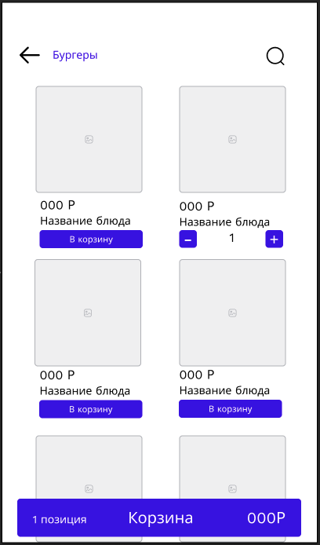
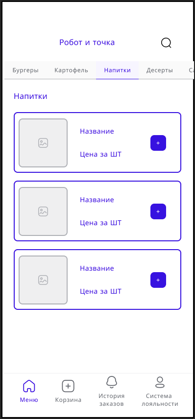

# WF-02 Категория меню. Список блюд

!!! quote ""
    Экран является реализацией сценариев [UC-05 Добавление блюда в корзину](../requirements/uc05.md).

## Терминал

### Элементы экрана

| **Элемент** | **Описание**                                                                                                                                                                                                                      | Взаимодействие&nbsp;с&nbsp;API     |
| :---------- | :-------------------------------------------------------------------------------------------------------------------------------------------------------------------------------------------------------------------------------- | :--------------------------------- |
| Назад       | Возврат в раздел выбора категории блюда.                                                                                                                                                                                          | —                                  |
| Категория   | Название категории блюд.                                                                                                                                                                                                          | —                                  |
| Поиск       | Иконка поиска по клику преобразуется в строку поиска по блюдам внутри категории.                                                                                                                                                  | —                                  |
| Меню        | Список блюд, относящихся к выбранной категории. Ячейка с блюдом содержит: 1. Изображение 2. Стоимость 3. Наименование По клику на ячейку происходит переход в карточку блюда.                                      | Метод «Получение списка блюд»      |
| В корзину   | Кнопка «В корзину». По нажатию на кнопку блюдо добавляется в корзину.                                                                                                                                                             | Метод «Добавление блюда в корзину» |
| Корзина     | Краткая информация о содержимом корзины.  Отображается, если в корзину добавлено хотя бы одно блюдо. Содержит: 1. Количество добавленных блюд. 2. Сумма добавленных блюд. При нажатии на кнопку, открывается корзина. | Метод «Добавление блюда в корзину» |

## Мобильное приложение

### Элементы экрана

| **Элемент**            | **Описание**                                                                                                                                                                                 | Взаимодействие&nbsp;с&nbsp;API          |
| :--------------------- | :------------------------------------------------------------------------------------------------------------------------------------------------------------------------------------------- | :-------------------------------------- |
| Поиск                  | Иконка поиска по клику преобразуется в строку поиска по блюдам внутри категории.                                                                                                             | —                                       |
| Категории              | Список категорий.                                                                                                                                                                            | Метод «Получение списка категорий меню» |
| Категория              | Название категории блюд.                                                                                                                                                                     | —                                       |
| Меню                   | Список блюд, относящихся к выбранной категории. Ячейка с блюдом содержит: 1. Изображение 2. Стоимость 3. Наименование По клику на ячейку происходит переход в карточку блюда. | Метод «Получение списка блюд»           |
| + (Добавить в корзину) | Кнопка «+». По нажатию на кнопку блюдо добавляется в корзину.                                                                                                                                | Метод «Добавление блюда в корзину»      |
| Таббар                 | При добавлении товара в корзину, на разделе «Корзина» добавляется каунтер с количеством добавленных товаров +1                                                                               | —                                       |
