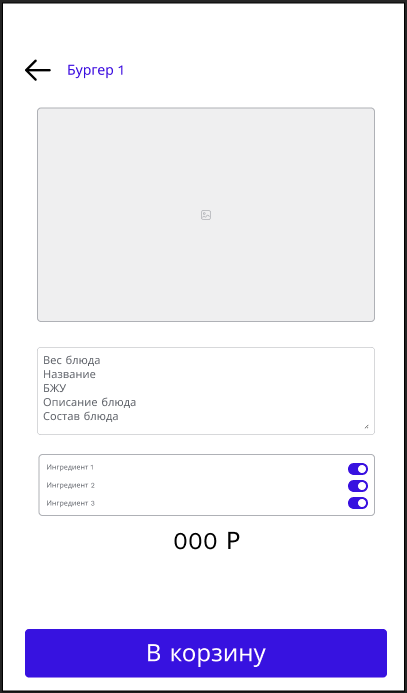
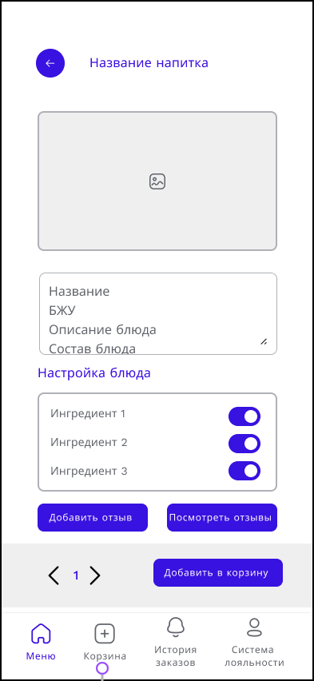

# WF-03 Карточка блюда

!!! quote ""
    Описание экрана связанных со сценарием [UC-05 Добавление блюда в корзину](../requirements/uc05.md)
## Терминал

### Элементы экрана

| **Элемент**    | **Описание**                                                                                                                                                                                                                                                                                      | Взаимодействие&nbsp;с&nbsp;API     |
| :------------- | :------------------------------------------------------------------------------------------------------------------------------------------------------------------------------------------------------------------------------------------------------------------------------------------------ | :--------------------------------- |
| Назад          | Возвращает к спискам блюд.                                                                                                                                                                                                                                                                        | —                                  |
| Наименование   | Название блюда.                                                                                                                                                                                                                                                                                   | Метод «Получение данных о блюде»   |
| Фотография     | Изображение блюда.                                                                                                                                                                                                                                                                                | Метод «Получение данных о блюде»   |
| Ингредиенты    | Блок выбора ингредиентов. Отображается только в карточке составного блюда. Ячейка ингредиента включает элементы: 1. Изображение 2. Стоимость 3. Наименование 4. Добавить/Убрать При переключении тумблера ингредиент добавляется к блюду. Ячейка ингредиента не кликабельна. | Вне MVP                            |
| Описание блюда | Описание блюда: 1. Размер/объем 2. Калорийность 3. БЖУ 4. Описание 5. Состав блюда                                                                                                                                                                                                 | Метод «Получение данных о блюде»   |
| Стоимость      | Стоимость блюда с учетом выбранных ингредиентов.                                                                                                                                                                                                                                                  | Метод «Получение данных о блюде»   |
| В корзину      | Кнопка «В корзину». По нажатию на кнопку блюдо добавляется в корзину.                                                                                                                                                                                                                             | Метод «Добавление блюда в корзину» |
## Мобильное приложение

### Элементы экрана

| **Элемент**    | **Описание**                                                                                                                                                                                                                                                                                      | Взаимодействие&nbsp;с&nbsp;API     |
| :------------- | :------------------------------------------------------------------------------------------------------------------------------------------------------------------------------------------------------------------------------------------------------------------------------------------------ | :--------------------------------- |
| Назад          | Возвращает к спискам блюд.                                                                                                                                                                                                                                                                        | —                                  |
| Наименование   | Название блюда.                                                                                                                                                                                                                                                                                   | Метод «Получение данных о блюде»   |
| Фотография     | Изображение блюда.                                                                                                                                                                                                                                                                                | Метод «Получение данных о блюде»   |
| Ингредиенты    | Блок выбора ингредиентов. Отображается только в карточке составного блюда. Ячейка ингредиента включает элементы: 1. Изображение 2. Стоимость 3. Наименование 4. Добавить/Убрать При переключении тумблера ингредиент добавляется к блюду. Ячейка ингредиента не кликабельна. | Вне MVP                            |
| Описание блюда | Описание блюда: 1. Размер/объем 2. Калорийность 3. БЖУ 4. Описание 5. Состав блюда                                                                                                                                                                                                 | Метод «Получение данных о блюде»   |
| Стоимость      | Стоимость блюда с учетом выбранных ингредиентов.                                                                                                                                                                                                                                                  | Метод «Получение данных о блюде»   |
| В корзину      | Кнопка «В корзину». По нажатию на кнопку блюдо добавляется в корзину.                                                                                                                                                                                                                             | Метод «Добавление блюда в корзину» |
| Калорийность   | Количество килокалорий.                                                                                                                                                                                                                                                                           | Метод «Получение данных о блюде»   |
| Таббар         | При добавлении товара в корзину, на разделе «Корзина» добавляется каунтер с количеством добавленных товаров +1                                                                                                                                                                                    | —                                  |
