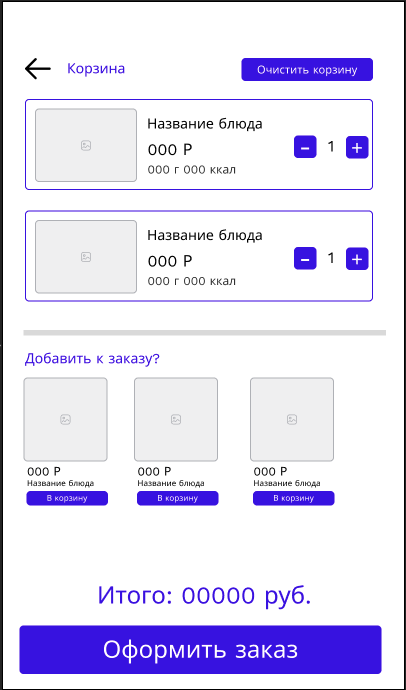
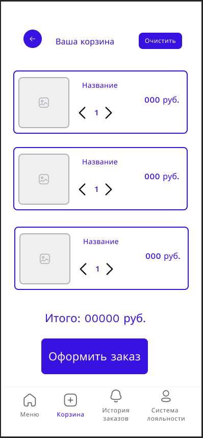

# WF-04 Корзина

!!! quote ""
    Описание экрана связанных со сценарием [UC-06 Просмотр корзины](../requirements/uc06.md) и [UC-07 Редактирование корзины](../requirements/uc07.md).

## Терминал

### Элементы экрана

| **Элемент**        | **Описание**                                                                                                                                                                                                                                                                                               | Взаимодействие&nbsp;с&nbsp;API                              |
| :----------------- | :--------------------------------------------------------------------------------------------------------------------------------------------------------------------------------------------------------------------------------------------------------------------------------------------------------- | :---------------------------------------------------------- |
| Назад              | Возвращает на экран, с которого был произведен переход в корзину.                                                                                                                                                                                                                                          | —                                                           |
| Корзина            | Заголовок экрана.                                                                                                                                                                                                                                                                                          | —                                                           |
| Очистить корзину   | Удаляет все добавленные блюда из корзины.                                                                                                                                                                                                                                                                  | —                                                           |
| Заказ              | Блок со списком блюд, добавленных в корзину. Ячейка блюда включает элементы: 1. Изображение 2. Наименование 3. Стоимость 4. Размер/объем 5. Калорийность 6. Элемент изменения количества экземпляров блюда: кнопки –/+.                                                               | Методы «Просмотр корзины», «Редактирование блюда в корзине» |
| Добавить к заказу? | Раздел предложений со списком блюд. Не может включать блюда, уже добавленные в корзину. Ячейка блюда: 1. Изображение 2. Стоимость 3. Наименование 4. Кнопка «В корзину». По нажатию на кнопку блюдо добавляется в корзину. По клику на ячейке блюда происходит переход в карточку блюда. | Метод «Добавление блюда в корзину»                          |
| Итого              | Стоимость блюда с учетом выбранных ингредиентов.                                                                                                                                                                                                                                                           | Метод «Просмотр корзины»                                    |
| Оформить заказ     | Кнопка «Оформить заказ». По нажатию на кнопку происходит переход к оформлению заказа.                                                                                                                                                                                                                      | —                                                           |

## Мобильное приложение

### Элементы экрана

| **Элемент**    | **Описание**                                                                                                                                                                                           | Взаимодействие&nbsp;с&nbsp;API                              |
| :------------- | :----------------------------------------------------------------------------------------------------------------------------------------------------------------------------------------------------- | :---------------------------------------------------------- |
| Назад          | Возвращает на экран, с которого был произведен переход в корзину.                                                                                                                                      | —                                                           |
| Ваша корзина   | Заголовок экрана.                                                                                                                                                                                      | —                                                           |
| Очистить       | Удаляет все добавленные блюда из корзины.                                                                                                                                                              | —                                                           |
| Заказ          | Блок со списком блюд, добавленных в корзину. Ячейка блюда включает элементы: 1. Изображение 2. Наименование 3. Стоимость 4. Элемент изменения количества экземпляров блюда: кнопки –/+. | Методы «Просмотр корзины», «Редактирование блюда в корзине» |
| Итого          | Стоимость блюда с учетом выбранных ингредиентов.                                                                                                                                                       | Метод «Просмотр корзины»                                    |
| Оформить заказ | Кнопка «Оформить заказ». По нажатию на кнопку происходит переход к оформлению заказа.                                                                                                                  | —                                                           |

