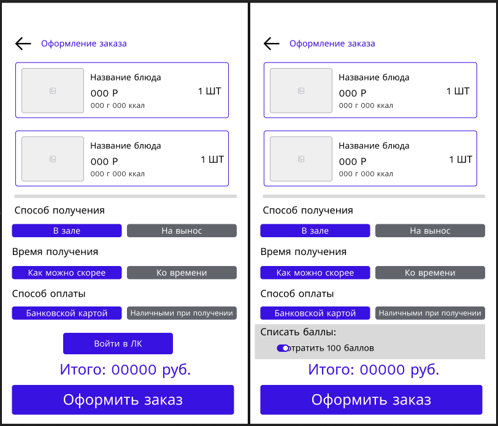
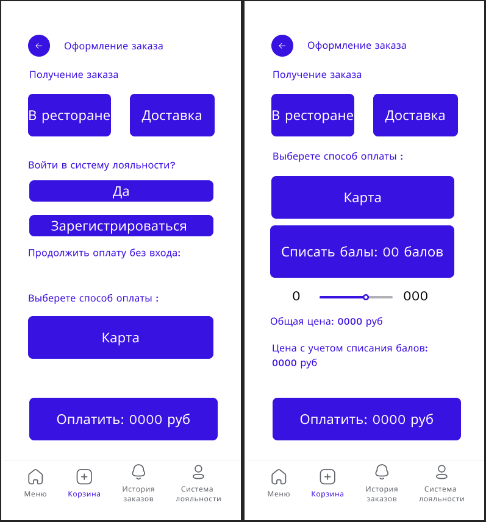

# WF-05 Оформление заказа

!!! quote ""
    Экран является реализацией сценария [UC-07 Оформление заказа](../requirements/uc07.md). 

## Терминал

### Элементы экрана

| **Элемент**             | **Описание**                                                                                                                                                                                                                                                                                                  | Взаимодействие&nbsp;с&nbsp;API |
| :---------------------- | :------------------------------------------------------------------------------------------------------------------------------------------------------------------------------------------------------------------------------------------------------------------------------------------------------------ | :----------------------------- |
| Назад                   | Возвращает на предыдущий шаг.                                                                                                                                                                                                                                                                                 | —                              |
| Оформление заказа       | Заголовок экрана.                                                                                                                                                                                                                                                                                             | —                              |
| Заказ                   | Блок со списком блюд, добавленных в заказ. Ячейка блюда включает элементы: 1. Изображение 2. Наименование 3. Стоимость 4. Размер/объем 5. Калорийность 6. Количество                                                                                                                     | Методы «Просмотр корзины»      |
| Способ получения заказа | Выбор способа получения заказа: В зале / Навынос.                                                                                                                                                                                                                                                             | —                              |
| Время получения заказа  | Выбор времени получения заказа: Как можно скорее / Ко времени. При выборе варианта «Ко времени» открывается окно для выбора времени готовности заказа.                                                                                                                                                     | —                              |
| Способ оплаты           | Выбор способа оплаты: Банковской картой / Наличными при получении.                                                                                                                                                                                                                                            | —                              |
| Программа лояльности    | Если пользователь авторизован, то отображается сумма баллов программы лояльности и переключатель для выбора, списания баллов (если есть). Если пользователь не авторизован, то отображается кнопка «Войти в ЛК». По нажатию на кнопку происходит переход к регистрации/авторизации в программе лояльности. | —                              |
| Итого                   | Сумма заказа с учетом скидок и баллов.                                                                                                                                                                                                                                                                        | Метод «Просмотр корзины»       |
| Оформить заказ          | Кнопка «Оформить заказ». Если выбран способ оплаты «Банковской картой», отображается окно ожидания оплаты.  Если выбран «Наличными при получении», то подтверждение и открывается экран с номером заказа.                                                                                               | Метод «Оформление заказа»      |

## Мобильное приложение

### Элементы экрана

| **Элемент**                   | **Описание**                                                                                                                                                                                                                               | Взаимодействие&nbsp;с&nbsp;API |
| :---------------------------- | :----------------------------------------------------------------------------------------------------------------------------------------------------------------------------------------------------------------------------------------- | :----------------------------- |
| Назад                         | Возвращает на предыдущий шаг.                                                                                                                                                                                                              | —                              |
| Оформление заказа             | Заголовок экрана.                                                                                                                                                                                                                          | —                              |
| Способ получения заказа       | Выбор способа получения заказа: В ресторане / Доставка. Если выбран пункт «В ресторане», открывается окно выбора времени, когда будет получен заказ. Если выбран пункт «Доставка», открывается форма для заполнения адреса дсотавки. | —                              |
| Войти в программу лояльности? | Необязательный пункт. Если выбран пункт «Да», открывается экран входа в ЛК.  Если выбран пункт «Зарегистрироваться», открывается экран регистрации в ЛК.                                                                             | —                              |
| Способ оплаты                 | При нажатии открывает форму заполнения банковских реквизитов.                                                                                                                                                                              | —                              |
| Списать баллы                 | Отображается для авторизованных пользователей.                                                                                                                                                                                             | —                              |
| Сумма баллов                  | Настройка количества балов, которые будут списаны.                                                                                                                                                                                         | Метод «Просмотр корзины»       |
| Оплатить                      | При нажатии отображается окно ожидания оплаты.                                                                                                                                                                                             | Метод «Оформление заказа»      |