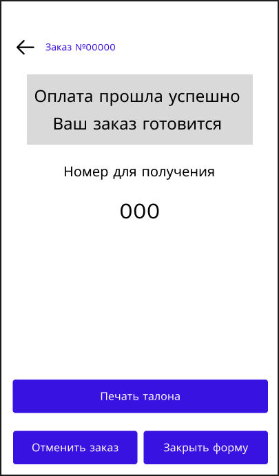
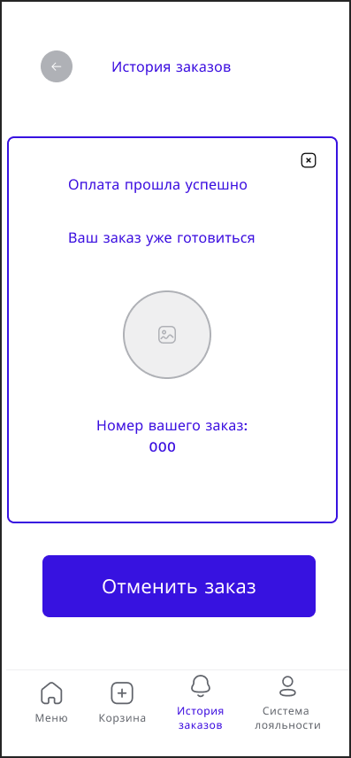

# WF-06 Подтверждение заказа

## Терминал

### Элементы экрана

| **Элемент**     | **Описание**                                                                                   | Взаимодействие&nbsp;с&nbsp;API |
| :-------------- | :--------------------------------------------------------------------------------------------- | :----------------------------- |
| Назад           | Возвращает на экран отображения категорий меню.                                                | —                              |
| История заказов | Заголовок экрана.                                                                              | —                              |
| Оплата прошла   | Список заказов пользователя. По нажатию на ячейку заказа происходит переход в карточку заказа. | —                              |
| Статус заказа   | Отображает статус оформленного заказа «Принят в работу».                                       | —                              |
| Номер заказа    | Отображает номер заказ                                                                         | Методы «Оформление заказа»     |
| Печать тална    | При нажатии инициирует печать талона с номером заказа.                                         | —                              |
| Отмена заказа   | Отображается подтверждение действия для отмены заказа.                                         | Методы «Отмена заказа»         |
| Закрыть форму   | Возвращает на экран отображения категорий меню.                                                | —                              |

## Мобильное приложение

### Элементы экрана

| **Элемент**     | **Описание**                                                                                   | Взаимодействие&nbsp;с&nbsp;API |
| :-------------- | :--------------------------------------------------------------------------------------------- | :----------------------------- |
| Назад           | Возвращает на экран отображения категорий меню.                                                | —                              |
| История заказов | Заголовок экрана.                                                                              | —                              |
| Оплата прошла   | Список заказов пользователя. По нажатию на ячейку заказа происходит переход в карточку заказа. | —                              |
| Статус заказа   | Отображает статус оформленного заказа «Принят в работу».                                       | —                              |
| Штрихкод        | Генерация штрихкода, для получения заказа.                                                     | —                              |
| Номер заказа    | Отображает номер заказ                                                                         | Методы «Оформление заказа»     |
| Отмена заказа   | Отображается подтверждение действия для отмены заказа.                                         | Методы «Отмена заказа»         |
