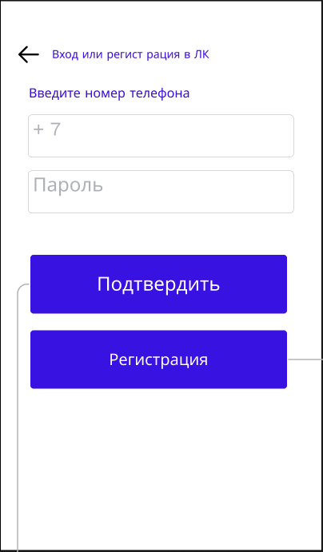
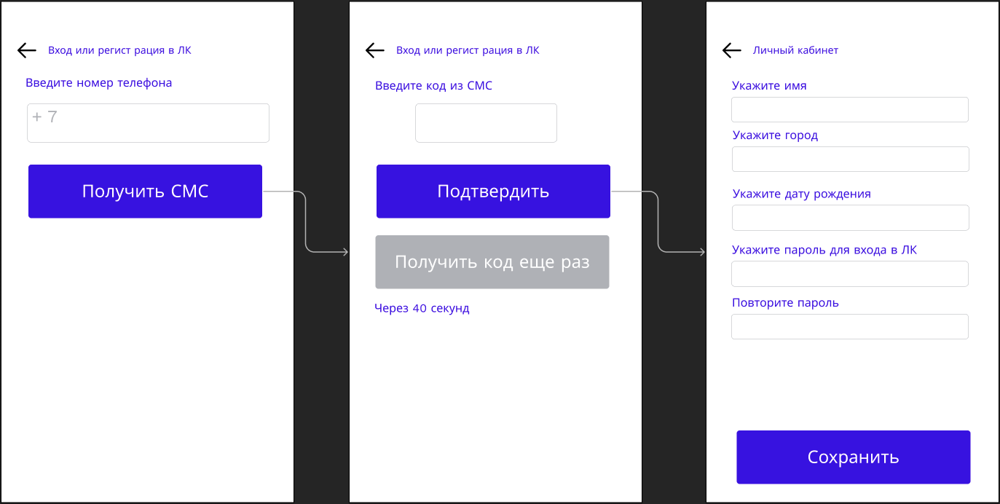
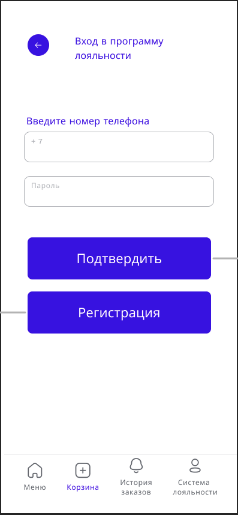
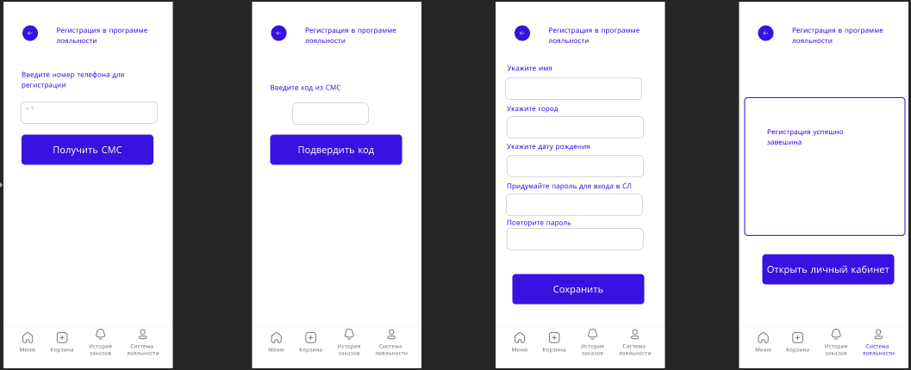

# WF-07 Регистрация/авторизация

!!! quote ""
    Экран является реализацией сценариев [UC-01 Регистрация в программе лояльности](../requirements/uc01.md) и [UC-02 Авторизация в программе лояльности](../requirements/uc02.md).

## Терминал

### Элементы экрана

| **Элемент**    | **Описание**                                                                                                                                                  | Взаимодействие&nbsp;с&nbsp;API        |
| :------------- | :------------------------------------------------------------------------------------------------------------------------------------------------------------ | :------------------------------------ |
| Назад          | Возвращает на предыдущий шаг.                                                                                                                                 | —                                     |
| Заголовок      | Заголовок экрана.                                                                                                                                             | —                                     |
| Номер телефона | Поле для ввода номера телефона.  Ввод по маске +X (XXX) XXX XX XX. Допустимые символы: цифры от 0 до 9.                                                 | —                                     |
| Пароль         | Поле для ввода пароля. Длина 6 знаков. Допустимые символы: цифры от 0 до 9.                                                                                   | —                                     |
| Подвердить     | Инициирует проверку пароля от ЛК. Если пароль верный, происходит переход в личный кабинет. При ошибке ввода пароля, отображается уведомление об ошибке. | Методы «Аутентификация пользователя»  |
| Регистрация    | Открывает форму регистрации Пользователя.                                                                                                                     | Методы «Создание нового пользователя» |

### Элементы экрана регистрации

| **Элемент**           | **Описание**                                                                                                                                                                                                                                                     | Взаимодействие&nbsp;с&nbsp;API         |
| :-------------------- | :--------------------------------------------------------------------------------------------------------------------------------------------------------------------------------------------------------------------------------------------------------------- | :------------------------------------- |
| Назад                 | Возвращает на предыдущий шаг.                                                                                                                                                                                                                                    | —                                      |
| Заголовок             | Заголовок экрана.                                                                                                                                                                                                                                                | —                                      |
| Номер телефона        | Поле для ввода номера телефона.  Ввод по маске +X (XXX) XXX XX XX. Допустимые символы: цифры от 0 до 9.                                                                                                                                                    | —                                      |
| Получить СМС          | По нажатию на кнопку sms с кодом подтверждения отправляется на указанный номер телефона. На экране отображается поле для ввода кода подтверждения.                                                                                                            | —                                      |
| Код                   | Поле для ввода кода подтверждения. Длина 4 знака. Допустимые символы: цифры от 0 до 9.  Отправка запроса на проверку кода происходит автоматически после всех 4-х знаков кода. После успешной проверки кода происходит авторизация пользователя в системе. | Методы «Создание нового пользователя»  |
| Получить еще раз      | Счетчик времени до возможности повторной отправки кода подтверждения.  По истечении таймера кнопка становится активной. По нажатии на ссылку происходит повторная отправка кода подтверждения.                                                                | —                                      |
| Укажите имя           | Указывается имя пользователя на латинице или кириллице. Ограничение — до 25 знаков. Необязательное поле, может быть пустым.                                                                                                                                      | —                                      |
| Укажите город         | Указывается город на латинице или кириллице. Ограничение — до 25 знаков. Необязательное поле, может быть пустым.                                                                                                                                                 | —                                      |
| Укажите дату рождения | Указывается дата рождения в формате ДД.ММ.ГГГГ (день.месяц.год). Не допускается ввод будущих дат. Необязательное поле, может быть пустым.                                                                                                                        | —                                      |
| Укажите пароль        | Пароль является обязательным для заполнения. Пароль должен содержать от 6 до 8 символов. Допустимые символы: цифры от 0 до 9.                                                                                                                                 | —                                      |
| Повторите пароль      | Пароль должен совпадать с первым введённым паролем. В случае несовпадения выводится ошибка.                                                                                                                                                                      | —                                      |
| Сохранить             | Сохраняет введенные данные.                                                                                                                                                                                                                                      | Методы «Изменение данных пользователя» |

## Мобильное приложение

### Элементы экрана
| **Элемент**    | **Описание**                                                                                                                                                  | Взаимодействие&nbsp;с&nbsp;API                                       |
| :------------- | :------------------------------------------------------------------------------------------------------------------------------------------------------------ | :------------------------------------------------------------------- |
| Назад          | Возвращает на предыдущий шаг.                                                                                                                                 | —                                                                    |
| Заголовок      | Заголовок экрана.                                                                                                                                             | —                                                                    |
| Номер телефона | Поле для ввода номера телефона.  Ввод по маске +X (XXX) XXX XX XX. Допустимые символы: цифры от 0 до 9.                                                 | —                                                                    |
| Пароль         | Поле для ввода пароля. Длина 6 знаков. Допустимые символы: цифры от 0 до 9.                                                                                   | —                                                                    |
| Подвердить     | Инициирует проверку пароля от ЛК. Если пароль верный, происходит переход в личный кабинет. При ошибке ввода пароля, отображается уведомление об ошибке. | Методы «Аутентификация пользователя»                                 |
| Регистрация    | Открывает форму регистрации Пользователя.                                                                                                                     | Методы «Создание нового пользователя», «Аутентификация пользователя» |

### Элементы экрана регистрации

| **Элемент**           | **Описание**                                                                                                                                                                                                                                                     | Взаимодействие&nbsp;с&nbsp;API         |
| :-------------------- | :--------------------------------------------------------------------------------------------------------------------------------------------------------------------------------------------------------------------------------------------------------------- | :------------------------------------- |
| Назад                 | Возвращает на предыдущий шаг.                                                                                                                                                                                                                                    | —                                      |
| Заголовок             | Заголовок экрана.                                                                                                                                                                                                                                                | —                                      |
| Номер телефона        | Поле для ввода номера телефона.  Ввод по маске +X (XXX) XXX XX XX. Допустимые символы: цифры от 0 до 9.                                                                                                                                                    | —                                      |
| Получить СМС          | По нажатию на кнопку sms с кодом подтверждения отправляется на указанный номер телефона. На экране отображается поле для ввода кода подтверждения.                                                                                                            | —                                      |
| Код                   | Поле для ввода кода подтверждения. Длина 4 знака. Допустимые символы: цифры от 0 до 9.  Отправка запроса на проверку кода происходит автоматически после всех 4-х знаков кода. После успешной проверки кода происходит авторизация пользователя в системе. | Методы «Создание нового пользователя»  |
| Получить еще раз      | Счетчик времени до возможности повторной отправки кода подтверждения.  По истечении таймера кнопка становится активной. По нажатии на ссылку происходит повторная отправка кода подтверждения.                                                                | —                                      |
| Укажите имя           | Указывается имя пользователя на латинице или кириллице. Ограничение — до 25 знаков. Необязательное поле, может быть пустым.                                                                                                                                      | —                                      |
| Укажите город         | Указывается город на латинице или кириллице. Ограничение — до 25 знаков. Необязательное поле, может быть пустым.                                                                                                                                                 | —                                      |
| Укажите дату рождения | Указывается дата рождения в формате ДД.ММ.ГГГГ (день.месяц.год). Не допускается ввод будущих дат. Необязательное поле, может быть пустым.                                                                                                                        | —                                      |
| Укажите пароль        | Пароль является обязательным для заполнения. Пароль должен содержать от 6 до 8 символов. Допустимые символы: цифры от 0 до 9.                                                                                                                                 | —                                      |
| Повторите пароль      | Пароль должен совпадать с первым введённым паролем. В случае несовпадения выводится ошибка.                                                                                                                                                                      | —                                      |
| Сохранить             | Сохраняет введенные данные. После сохранения выводиться подтверждение.                                                                                                                                                                                           | Методы «Изменение данных пользователя» |