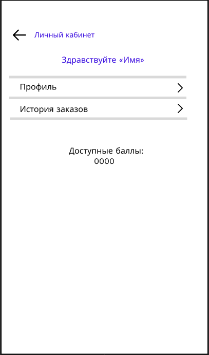

# WF-08 Просмотр ЛК программы лояльности

!!! quote ""
    Экран является реализацией сценария [UC-03 Просмотр ЛК программы лояльности](../requirements/uc03.md).

## Терминал

### Элементы экрана

| **Элемент**                | **Описание**                                                                                                                                            | Взаимодействие&nbsp;с&nbsp;API              |
| :------------------------- | :------------------------------------------------------------------------------------------------------------------------------------------------------ | :------------------------------------------ |
| Назад                      | Возвращает на предыдущий шаг.                                                                                                                           | —                                           |
| Заголовок                  | Заголовок экрана «Личный кабинет».                                                                                                                      | —                                           |
| Здраствуйте «Пользователь» | Имя пользователя. Элемент отображается, если пользователь авторизован. Если имя и фамилия не заполнены, то отображается номер телефона пользователя. | Метод «Получение информации о пользователе» |
| Профиль                    | Ссылка. Элемент отображается, если пользователь авторизован. По нажатию происходит переход к данным пользователя.                                    | —                                           |
| История заказов            | Ссылка. Элемент отображается, если пользователь авторизован. По нажатию происходит переход к списку заказов.                                         | —                                           |
| Доступные баллы            | Отображается сумма накопленных баллов.                                                                                                                  | —                                           |

