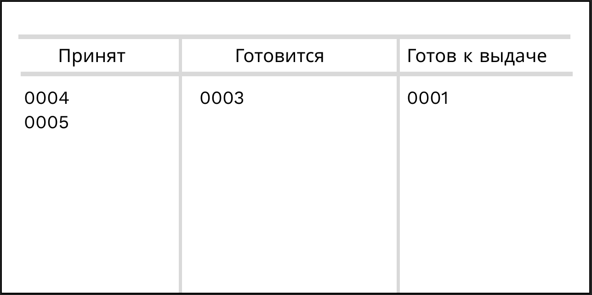

# WF-09 Табло в зале

!!! quote ""
    Экран является реализацией сценария [Отображение заказа на табло](../requirements/uc16.md).

### Прототип табло

### Элементы экрана

| **Элемент**    | **Описание**                                | Взаимодействие&nbsp;с&nbsp;API                         |
| :------------- | :------------------------------------------ | :----------------------------------------------------- |
| Принят         | Отображается, когда заказ принят в работу.  | GET/orders/{orderId}/status - Получение статуса заказа |
| Готовится      | Отображается, когда заказ начали готовить.  | GET/orders/{orderId}/status - Получение статуса заказа |
| Готов к выдаче | Отображается, когда заказ готов и упакован. | GET/orders/{orderId}/status - Получение статуса заказа |

