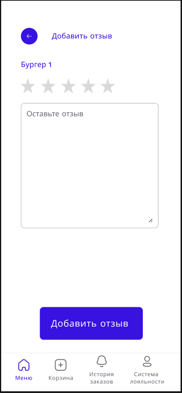

# WF-10 Добавление отзыва о блюде

!!! quote ""
    Экран является реализацией сценария [UC-15 Добавление отзыва о блюде](../requirements/uc15.md). 

## Мобильное приложение

### Элементы экрана

| **Элемент**    | **Описание**                                                                  | Взаимодействие&nbsp;с&nbsp;API                            |
| :------------- | :---------------------------------------------------------------------------- | :-------------------------------------------------------- |
| Назад          | Иконка возврата к карточке блюда.                                             | —                                                         |
| Название блюда | Название блюда на которое добавляется отзыв.                                  | —                                                         |
| Оставьте отзыв | Текстовое поле для отзыва.                                                    | —                                                         |
| Добавить отзыв | Кнопка «Отправить отзыв». По нажатию на кнопку  происходит сохранение отзыва. | POST/dishes/{dishId}/reviews - Добавление отзыва о блюде |
